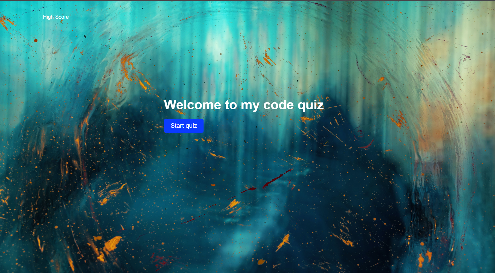

# JavaScript Quiz 
This is a simple quiz application built with HTML, CSS, and JavaScript. It features multiple choice questions with a timer and the ability to save scores.

# Getting Started
To run the application, simply open the index.html file in your web browser.

# Usage
Click the "Start Quiz" button to begin. You will have 75 seconds to answer all the questions. For each correct answer, you will receive a point. For each incorrect answer, 5 seconds will be deducted from the timer.

After all the questions have been answered, you will see your final score and have the option to save it by entering your initials and clicking "Save Score." Clicking "View all High Scores" will take you to a page displaying all the saved scores.

Click "Play Again" to start a new quiz.

# Technologies Used
1. HTML
2. CSS
3. JavaScript

## Deployed link
[Click here to access the deployed quiz](https://daleyjones.github.io/quiz-week4-java-code/)

## Credits
This Quiz project was created by [Daley Joness].

# License
This project is licensed under the MIT License - see the LICENSE.md file for details.

